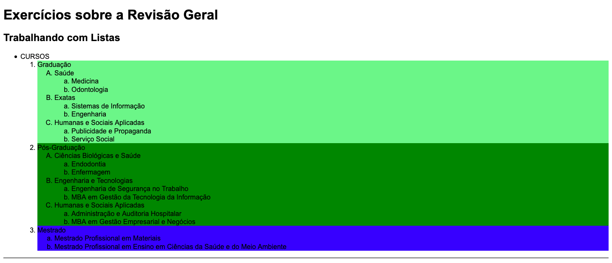
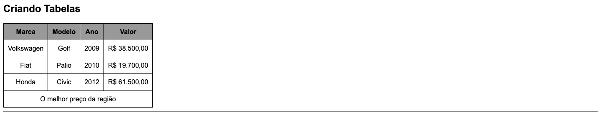
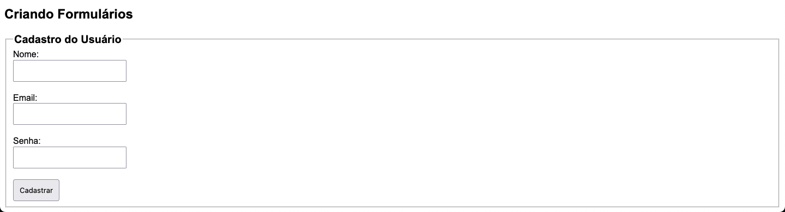

# Exercícios sobre a revisão de HTML5 e CSS3

Esta é uma atividade composta de 3 exercícios que deverão ser realizados dentro do mesmo documento HTML. 

Todas as imagens abaixo podem ser expandidas para melhor visualização através de um clique.

1. Em um documento HTML5, crie a tabela que será mostrada a seguir. Lembre-se de copiar todos os textos, utilizar os parâmetros de ordenação de listas propostos e colocar uma linha divisória entre este exercício e o próximo.

    As cores utilizadas no exercício foram: **lightgreen**, **green** e **blue**.

    
 
 

2. No mesmo documento HTML, crie a tabela abaixo. Lembre-se de utilizar os elementos semânticos &lt;thead&gt;, &lt;tbody&gt; e &lt;tfoot&gt;.

    As cores utilizadas no exercício foram: `#000` e `#999`

    

3. Ainda no mesmo documento HTML, crie o formulário abaixo. 

    

O usuário pode apenas clicar em cadastrar se todas as informações estiverem preenchidas corretamente. Para isso, adicione o atributo ***required***.

Lembre-se de utilizar os nomes corretos para cada tipo de input e de utilizar as tags &lt;fieldset&gt; e &lt;legend&gt;.

Cada uma das inputs assim como o botão receberam um preenchimento de **10px**.

O legend teve seu tamanho alterado para 20px e a intensidade da fonte mudada para 700 (bold).

Ao completar os exercícios, não se esqueça de enviar o arquivo HTML e o arquivo CSS juntos.